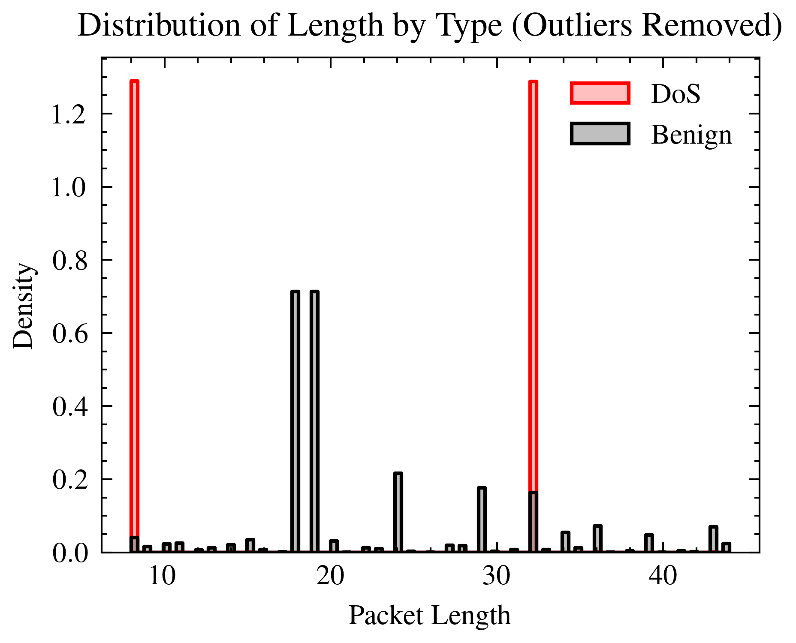
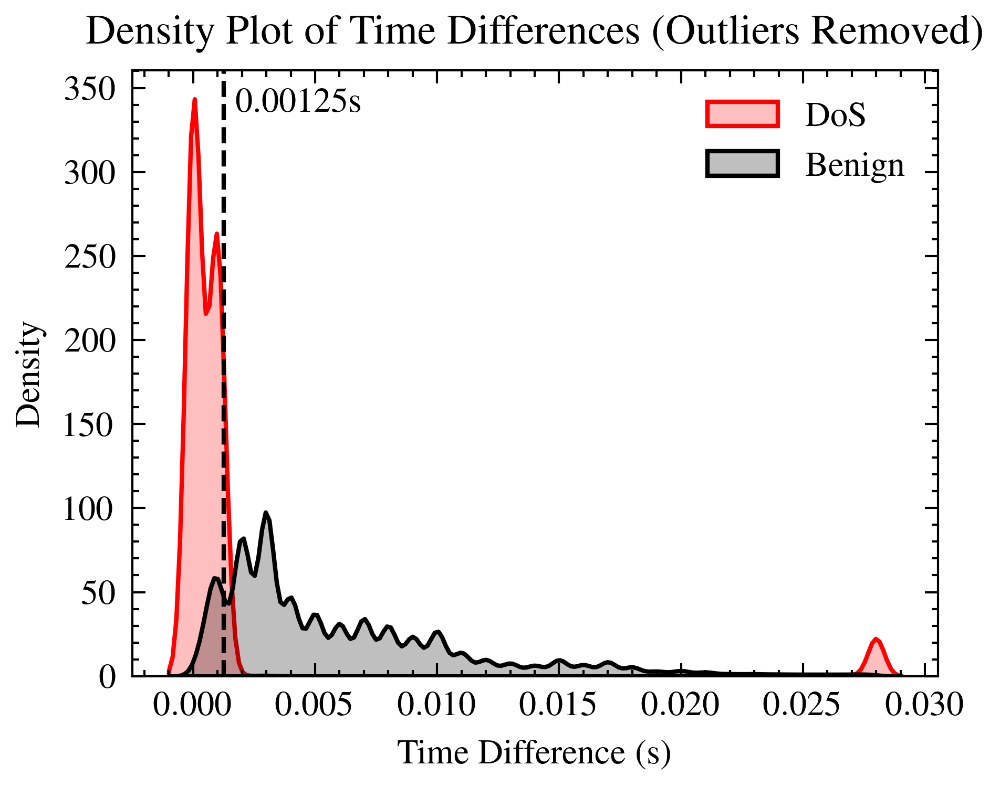
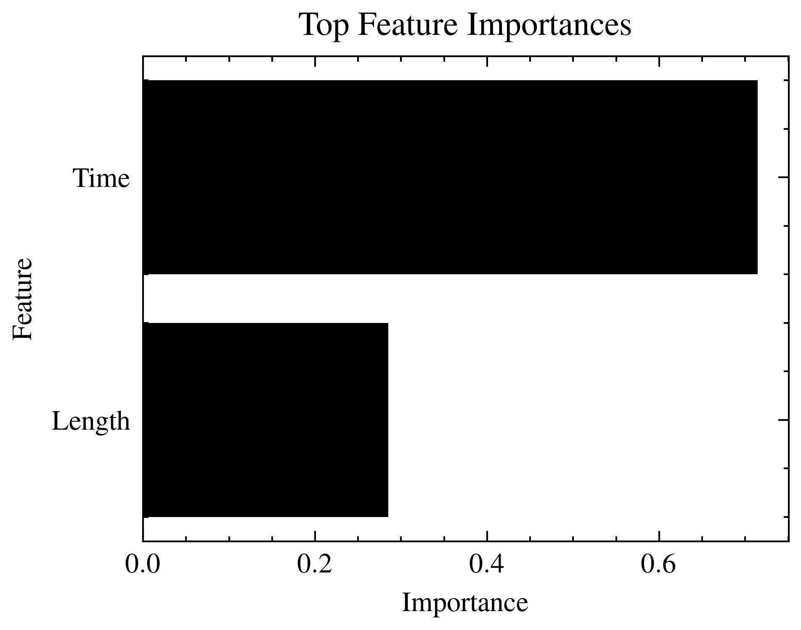
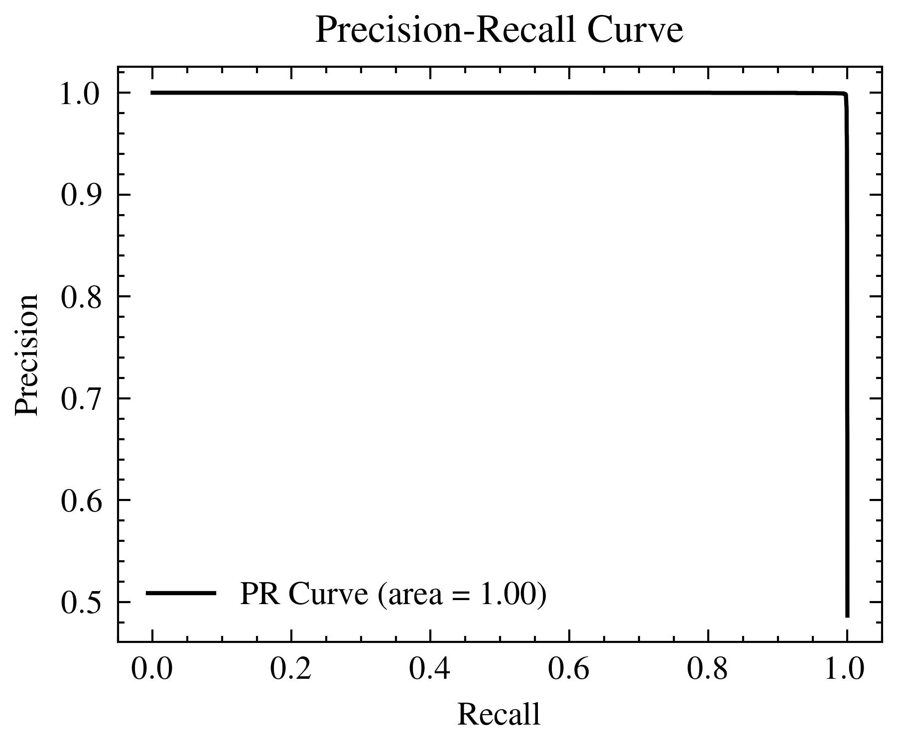
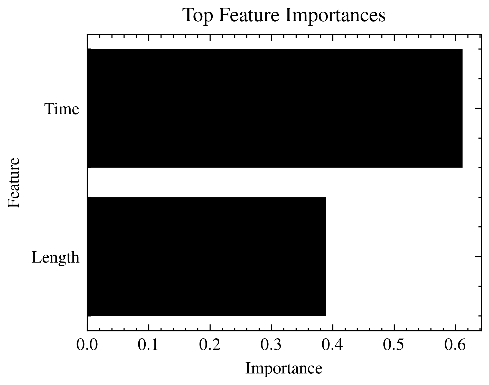
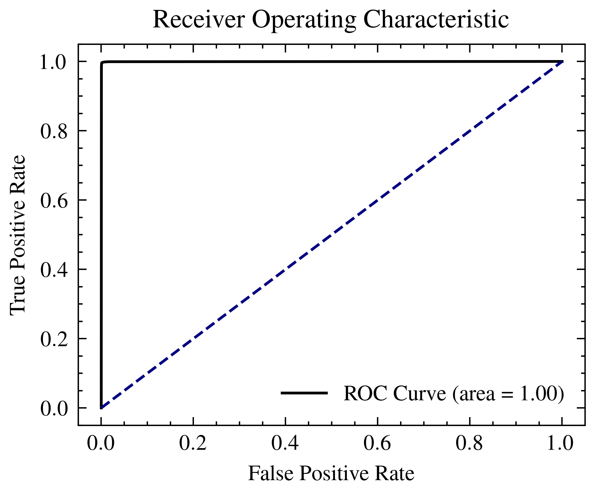

# Bluetooth DoS Detector

Three implementations of Bluetooth DoS attacks detection. The first is a
Gradient Boosting Machine classifier, the second is a Random Forest classifier,
and the third is a rule-based algorithm.

The project contains the main implementations of each using the best results in
the `scripts` folder. Different experiments were performed to determine the
best implementations using Jupyter notebooks in the `notebooks` folder. The
`data` folder contains the dataset used for training and testing the models.
The `models` folder contains the trained models.

A demonstration of the all three methods is also provided in the `scripts`
folder. All outputs from all scripts are saved to `dev.log` in the root of the
project.

## Prerequisites

- Python 3.12

## Environment Setup

For Linux or macOS, run the following:

```sh
# clone repo or download and extract the zip
git clone https://github.com/mohdfareed/bt-dos-detector.git
cd bt-dos-detector
./setup.sh
```

For Windows, run the following with PowerShell as an administrator:

```ps1
git clone https://github.com/mohdfareed/bt-attacks-detector.git
Set-Location -Path .\bt-attacks-detector
Set-ExecutionPolicy -ExecutionPolicy RemoteSigned -Scope Process
.\setup.ps1
```

## Dataset

Download the [dataset](https://www.unb.ca/cic/datasets/iomt-dataset-2024.html)
and place the Bluetooth attack/benign dataset in the `data` directory.
Processed data and models will be saved in the `data` and `models` directories.
Logs will be saved to the root of the project. Dataset statistics and model
evaluation results will be saved in the root of the project as well.

The dataset above contain mostly attack data, with a relatively small amount of
benign data. Benign data was captured on macOS to balance the dataset using
[PacketLogger](https://www.bluetooth.com/blog/a-new-way-to-debug-iosbluetooth-applications/),
then it was exported to `.btsnoop` format and converted to `.csv` format using
Wireshark. The captured data is not included in the repository due to its size.
The device had 2 headphones, a mouse, a smartwatch, and a game controller
connected to it. This process was repeated twice, once for balancing the
dataset and once to create the data for the demonstration. The captured data
can be downloaded from
[here](https://drive.google.com/file/d/1nPkZbiXhNc8zpFOwwX6NAAe4SncvrVb6/view?usp=sharing),
the the demo data an be downloaded from
[here](https://drive.google.com/file/d/1P6eQIv0IdKEqZU5xDMTySrgvhGHSyFKf/view?usp=sharing).

## Usage

The final project structure should be as follows:

```txt
project_root/
└── data/
    ├── benign_test.csv
    ├── benign_train.csv
    ├── capture.csv
    ├── demo.csv
    ├── dos_test.csv
    └── dos_train.csv
```

Open the Jupyter notebooks and select the environment `.venv` as the kernel to
run various experiments that were performed.

Run the following command to see the usage information of the main script:

```sh
source .venv/bin/activate # Linux/macOS
./main.py --help
```

```ps1
.\.venv\Scripts\Activate.ps1 # Windows
.\main.py --help
```

## Results

A demo video of the three implementations can be found
[here](https://drive.google.com/file/d/1zs5IKE3IwVf8u5dCiPvVBp_lHr98dAlY/view?usp=share_link).

### Feature Extraction

Feature extraction resulted in the following patterns:





Those two features, through experimentation, were found to be the most
discriminative features for the dataset.

### Gradient Boosting Machine

```txt
Test accuracy: 0.9979678844536394

Confusion matrix:
[[265024    463]
 [   588 251120]]

Classification report:
              precision    recall  f1-score   support

           0       1.00      1.00      1.00    265487
           1       1.00      1.00      1.00    251708

    accuracy                           1.00    517195
   macro avg       1.00      1.00      1.00    517195
weighted avg       1.00      1.00      1.00    517195
```






### Random Forest

```txt
Test accuracy: 0.9971287425439148

Confusion matrix:
[[264648    839]
 [   646 251062]]

Classification report:
              precision    recall  f1-score   support

           0       1.00      1.00      1.00    265487
           1       1.00      1.00      1.00    251708

    accuracy                           1.00    517195
   macro avg       1.00      1.00      1.00    517195
weighted avg       1.00      1.00      1.00    517195
```






### Rule-Based

- Training data accuracy: 93.2%
- Testing data accuracy: 90%
